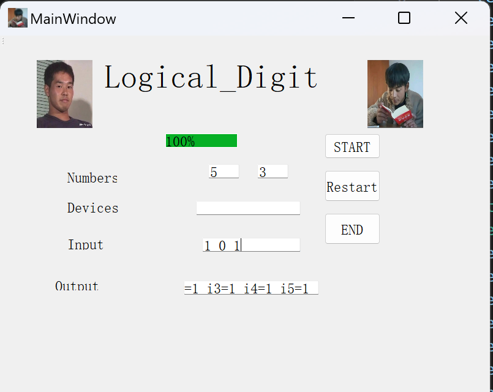

# Virtual-Digital-Logic
Use c++ to implement the digital logic
## The requirement for the input data
### part 1
1) The first line comes with the number of the logical circuits you want to implement
2)  Then every electrical circuit obeys the following input standard
3)  The first line comes with two int data indicating the numbers of input ports and devices respectively(assuming as m & n)
4)  The next m lines define every device as the following way.
5)  First it's the name of device, it mab be `NOT,AND,OR,NAND,NOR,XOR`
6)  Then comes the number of the input ports
7)  There is a prefix `(I\O)` before the ports, indicating that it's a input or output port, and every device only has an port to output data which shares the same index with itself
### part 2
1) First is a int data to indicate the time of different input implications
2) Then comes each equry in each line, at the beginning is number of the output ports you want to access
3) After it is the index of ouput port you want to access
## The form output would be displayed
If the structure is a loop `(which would change unstoppably)` Then just a `LOOP` would be printed on the moniter.
Else, it will output the result of each equry sequentially.
## indicates in the graphs
1) The structure of the first implement instance

The relativate input about it

3) The structure of the second implement instance

The relativate input about it

## How to use it
1) Store my file `Digital_Logic.h` in the relative directory and include it when you want to use
2) Use the `DigitalLogic` as the namespace to create a instance of class `Solution`
3) Use the `Telltime` method to put the first line of data in it
4) Following is an illustration about the implement

    
# UPDATE:THE INTERFACE
to improve the user's experience, I have developed a simple and easy interface to share.
## Taking instance
The following example would be used for explaining
### First input
One is the amount of devices (5) and the other is the amount of inports （3）
### Device
Following is the devices would be used to construct the equippment
1) XOR 2 I1 I2
2) XOR 2 O1 I3
3) AND 2 O1 I3
4) AND 2 O1 I3
5) AND 2 O1 I3
### Inports' value
Here is `1 0 1`
## Usage:
### Graph of the Interface

### Explaination：
1) The first two blanks, you should input the number of devices and inports and type `enter` respectively
2) Then you could pass the information of devices one by one to the `Devices` blank, and there is a process bar to show
the process of constructing. 
3) Then give the value of the inports to the `Input` blank to get on work
4) The result would then be printed on the `Output` blank
5) If you what to close the interface, click on `END`
6) If you what to implement another instance, click on `Restart` and input.
## Points worth attention
1) The `Start` button is just no use.
2) The same instance could not be implemented on different value for the inports, you must click on `Restart` and fill the blank to run.
   
