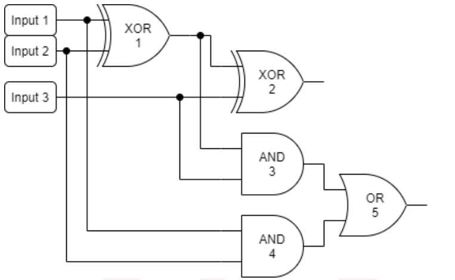
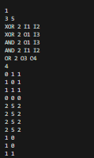
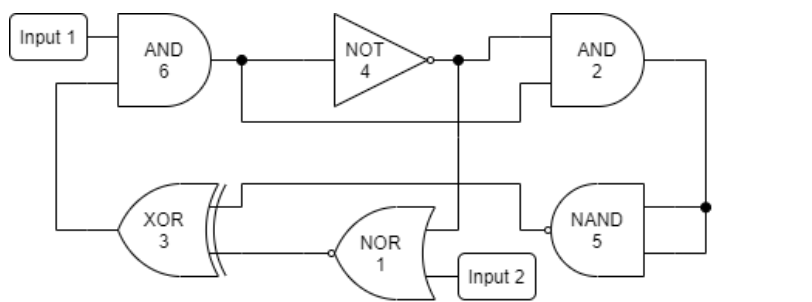
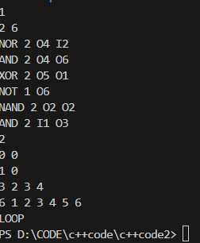
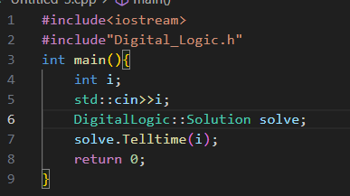

# Virtual-Digital-Logic
Use c++ to implement the digital logic
## The requirement for the input data
### part 1
1) The first line comes with the number of the logical circuits you want to implement
2)  Then every electrical circuit obeys the following input standard
3)  The first line comes with two int data indicating the numbers of input ports and devices respectively(assuming as m & n)
4)  The next m lines define every device as the following way.
5)  First it's the name of device, it mab be `NOT,AND,OR,NAND,NOR,XOR`
6)  Then comes the number of the input ports
7)  There is a prefix `(I\O)` before the ports, indicating that it's a input or output port, and every device only has an port to output data which shares the same index with itself
### part 2
1) First is a int data to indicate the time of different input implications
2) Then comes each equry in each line, at the beginning is number of the output ports you want to access
3) After it is the index of ouput port you want to access
## The form output would be displayed
If the structure is a loop `(which would change unstoppably)` Then just a `LOOP` would be printed on the moniter.
Else, it will output the result of each equry sequentially.
## indicates in the graphs
1) The structure of the first implement instance

The relativate input about it

3) The structure of the second implement instance

The relativate input about it

## How to use it
1) Store my file `Digital_Logic.h` in the relative directory and include it when you want to use
2) Use the `DigitalLogic` as the namespace to create a instance of class `Solution`
3) Use the `Telltime` method to put the first line of data in it
4) Following is an illustration about the implement

    
  
   
